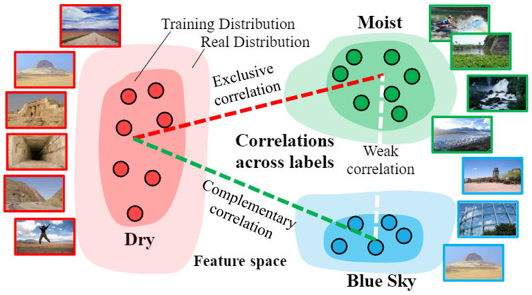
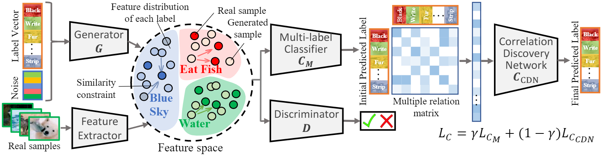

# Generative Correlation Discovery Network for Multi-Label Learning (GCDN)
This repository contains code for our IEEE International Conference on Data Mining (ICDM) 2019 paper (Regular paper): [Generative Correlation Discovery Network for Multi-Label Learning](https://github.com/wanglichenxj/Generative-Correlation-Discovery-Network-for-Multi-Label-Learning/blob/master/presentation/ICDM19_MultiLabel.pdf) (GCDN). 

## Our paper
### Introduction
<div align="center">
    
</div>

The goal of Multi-label learning is to predict multiple labels of each single instance. This is a challenging problem since the training data is limited, long-tail label distribution, and complicated label correlations. Generally, more training samples and label correlation knowledge would benefit the learning performance. However, it is difficult to obtain large-scale well-labeled datasets, and building such a label correlation map requires sophisticated semantic knowledge. 

### Our model
<div align="center">
    
</div>

To this end, we propose an end-to-end Generative Correlation Discovery Network (GCDN) method for multi-label learning in this paper. GCDN captures the existing data distribution, and synthesizes diverse data to enlarge the diversity of the training features; meanwhile, it also learns the label correlations based on a specifically-designed, simple but effective correlation discovery network to automatically discover the label correlations and considerately improve the label prediction accuracy. Extensive experiments on several benchmarks are provided to demonstrate the effectiveness, efficiency, and high accuracy of our approach.

## Running the code
The code is python code works in Ubuntu system. Tensorflow 1.5.0 is tested in this version, other versions should also work well. We provided two seperate demos for AWA and CUB datasets associated with the arranged datasets in the folder. The details are introduced below:

**GCDN_AWA_demo.py** -- It is the demo code and the parameters are tuned for AWA dataset. It contains the dataset loading, main model construction, and results output sections.

**GCDN_CUB_demo.py** -- It is the demo code and the parameters are tuned for CUB dataset. It contains the dataset loading, main model construction, and results output sections.

**evaluation_GCDN.py** -- It is the evaluation code which obtains the Precision, Recall, F1, Non-zero Recall, and mAP respectively.


## Authors
Welcome to send us Emails if you have any questions about the code and our work :-)
* **Lichen Wang** [Website](https://sites.google.com/site/lichenwang123/)
* **Zhengming Ding** [Website](http://allanding.net/)
* **Seungju Han**
* **Jae-Joon Han**
* **Changkyu Choi**
* **Yun Raymond Fu** [Website](http://www1.ece.neu.edu/~yunfu/)

## Citation
Please cite our paper if you like or use our work for your research, thank you very much!
```
@inproceedings{GCDN_Lichen,
  title={Generative Correlation Discovery Network for Multi-Label Learning},
  author={Wang, Lichen and Ding, Zhengming and Han, Seungju and Han, Jae-Joon and Choi, Changkyu and Fu, Yun},
  booktitle={Proceedings of IEEE International Conference on Data Mining},
  year={2019}
}
```


